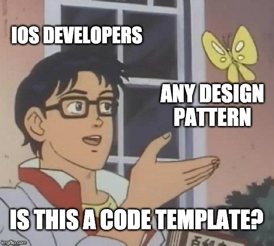

## A New Revelation

Working with software this semester has felt a lot like learning how to move through a place you thought you already understood. At first everything seems straightforward write code that just work, you know. But the deeper I got, the more I realized that programming is about building easy to read/edit code and it being functional. 

It’s navigating a system that quickly becomes larger than whatever I can hold in my head at once. That’s when I started noticing certain patterns showing up, almost like familiar landmarks scattered around a city.

## Sitting in the Revelation

These patterns weren’t rules I memorized or strict steps I followed. They were like hints that helped guide how I organized my thoughts. Whenever I try building something out, I found myself recognizing shapes in the code such as little repeating structures that made the whole thing easier to manage. Some patterns helped me avoid rewriting the same logic in different places. 

Others helped me keep different parts of my program from stepping on each other. And some simply made the flow of information more predictable, like having reliable roads that always take you where you expect to go.

## Moving Past and Moving Forward

I didn’t think much about these ideas before, but over time they changed the way I approached problems. Instead of staring at a blank screen wondering where to start, I began to rely on these patterns the same way you rely on muscle memory when driving a route. They gave structure to the chaos and made even complicated tasks feel manageable.

What surprised me most is how naturally they appeared once I started paying attention. I didn’t sit down with a list of design patterns and try to implement them. They simply emerged as the most sensible way to make my code flexible, organized, and understandable. And now that I’ve seen them in action, it’s hard to imagine working without them.

In collaboration with ChatGPT for both grammar checking and proof reading.
