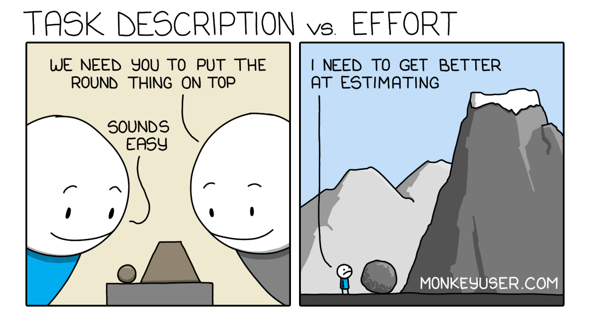

## How did you make your effort estimates?

The effort estimations were created based on prior assignments and the issues assigned throughout the project. These estimates were informed by general experience from earlier coursework rather than detailed historical data, serving mainly as rough guidelines rather than precise predictions.

## Did estimating in advance provide any benefit?

Overall, estimating in advance did not provide much benefit for this project. Even when estimates were inaccurate, the work still had to be completed the same way. I think estimation would be more useful in a larger team where workload distribution matters more.

## Was tracking effort useful?

Tracking actual effort was not particularly useful in this case. The project was small enough that progress was better measured by completing issues rather than tracking time. It did not significantly inform future estimates or decisions.

## How did you track actual effort, how accurate do you believe it was?

Actual effort was tracked using GitHub by observing the time between branch creation and commits. This method was not very accurate because work was often stopped and resumed at different times. Therefore, relying on GitHub timestamps does not reflect active working time.

## Reflection

In the future, I would fit the effort estimation to the size of the group. This kind of organization depends mostly on the amount of people working on it and the time taken away from the main task. What would help is a dedicated timer to track actual working time more accurately. This would provide better data for effort estimation and make tracking more meaningful, especially for larger or longer-term projects.

In collaboration with ChatGPT for both grammar checking and proof reading.
