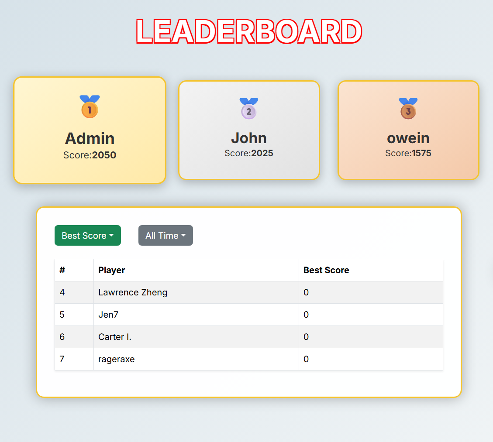

The University of Hawaiʻi at Mānoa is a fairly large campus, and with that size comes difficulty navigating it especially for incoming freshmen. With that in mind, why not provide a fun and unique way to explore the campus while also making it competitive? This is where Manoa Guesser comes in. The application presents users with an image of a random location on campus, and the player must determine where that location is on a map. Since images can also be provided by users, the game is community-driven as well. This encourages students to have fun while discovering new places to study or hang out. Additionally, given how competitive some people can be, the leaderboard feature pushes players to improve their knowledge of campus and aim for the top rankings.

Because this was a group project, credit goes to my teammates Jia Jun Li, Lawrence Zheng, and Colbren Fujimoto. My primary contribution was creating and implementing the leaderboard system and handling how score data was retrieved from the game portion of the website. This involved designing a schema model to store scores in an array so they could be reused later. After determining how scores would be calculated for each round, the data was routed to the database and stored with the corresponding user. This structure allowed me to perform additional calculations, such as filtering scores by best and averaging performance. I also worked on styling the leaderboard so it did not appear overly simple. I created distinct cards for the top three players, each displaying their name and medal placement, with the remaining scores shown below. These elements update dynamically based on the selected filters. This design emphasizes the competitive nature of the game and allows different players to be highlighted depending on their performance. A screenshot of the leaderboard is included below.

Through this project, I learned that working in a group can be challenging, especially when there is no clear, shared vision of what needs to be done. While it is unrealistic to anticipate every issue beforehand, having a solid plan and general consensus early on makes the process significantly smoother. Without that foundation, the difficulty increases rapidly. I also found it challenging to work with code written by others that could potentially conflict with my own, even when working within separate branches. This required careful coordination and testing to ensure everything functioned correctly. Overall, this experience helped me better understand the importance of communication, planning, and caution when collaborating on group software projects.

Here is the Github organization: [Manoa Guesser](https://github.com/manoa-guesser)
